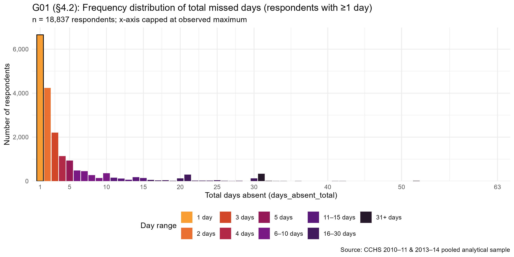
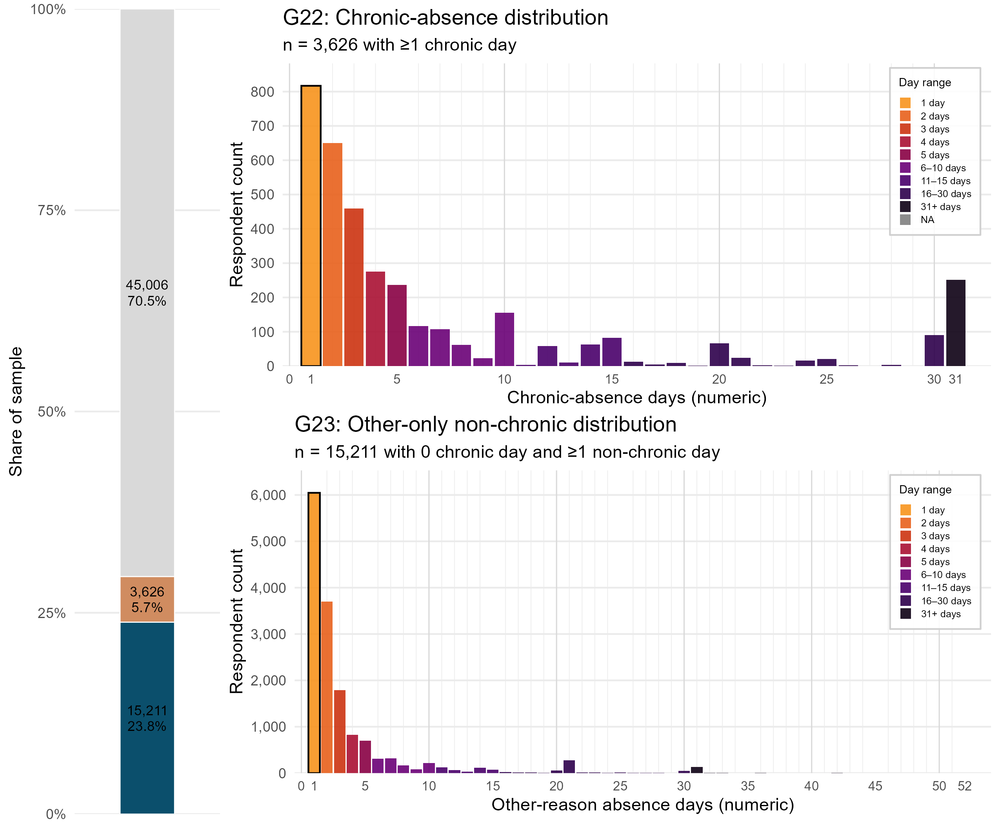
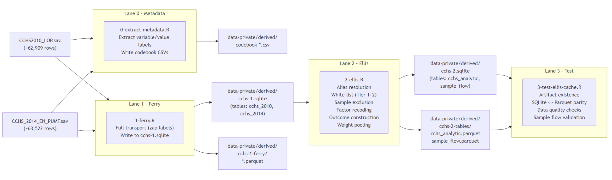

## Predictors of Work Absenteeism Associated with Chronic Conditions Among Canadian Workers

**Study:** *Predictors of Work Absenteeism Associated with Chronic Conditions
Among Canadian Workers: An Analysis of the Canadian Community Health Survey.*

**Authors:** Marc-Andre Blanchette, Oleksandr Koval, Andriy Koval.

This site is a structured record of the descriptive-epidemiology work responding
to the study Project Proposal. It documents the statistical analysis
requirements, the data pipeline, the variable-selection rationale, and
exploratory descriptive findings organized by the Andersen Behavioral Model
domains. The analytic dataset pools two cycles of the Canadian Community Health
Survey (CCHS 2010–2011 and 2013–2014) and its Loss of Productivity (LOP) module.

The analytic file contains **63,843 respondents** across **69 columns**, pooled
from the two CCHS cycles.

## Outcome in Focus

The primary outcome is the total number of workdays missed in the three months
preceding the survey for any health-related reason — a count variable
constructed by summing the eight LOP component reasons.

{width=90%}

The outcome is highly zero-inflated: roughly 70% of respondents report zero
absent days. The split below contrasts the distribution shape for respondents
whose absence is attributable to chronic conditions against all other reasons.

{width=90%}

## Pipeline

The analytic dataset is produced by a validated Ferry → Ellis → Test pipeline
that transports the raw CCHS PUMF files, standardizes and harmonizes variables
across cycles, applies the sample-exclusion criteria, and constructs the outcome.

{width=90%}

## How to Navigate This Site

- **Project** — the full Project Proposal defining the analysis requirements.
- **Pipeline** — the pipeline guide plus the CACHE and INPUT data manifests
  describing the analytic dataset and its raw inputs.
- **Data Primer** — the variable-inclusion traceability record (requirements to
  implementation) and the univariate distributions of every study variable.
- **Analysis** — exploratory descriptive reports for the outcome and for each
  Andersen Model domain (exposure, predisposing, facilitating, needs) plus a
  missingness review.
- **Site Map** — an oriented index of every page and how it maps to the Project
  Proposal.
