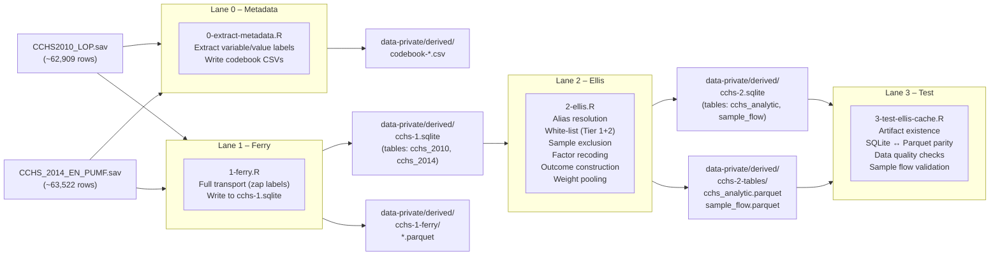

# CCHS Absenteeism Pipeline

This document is the execution guide and architecture reference for the CCHS
absenteeism data pipeline. It describes the seven pipeline artifacts, how to
run them, and how to diagnose common problems.

## Pipeline Architecture

<!-- PIPELINE-DIAGRAM-SOURCE -->


<!-- PIPELINE-DIAGRAM -->


## Execution Order

Run scripts in numerical order from the project root directory.

```powershell
Rscript manipulation/0-extract-metadata.R   # ~2-5 min (reads .sav + codebooks)
Rscript manipulation/1-ferry.R              # ~5-15 min (reads full .sav files)
Rscript manipulation/2-ellis.R              # ~2-5 min
Rscript manipulation/3-test-ellis-cache.R   # ~1 min
```

Or run the full pipeline via `flow.R`:

```powershell
Rscript flow.R
```

## Seven Artifacts

| # | File | Pattern | Status |
| --- | --- | --- | --- |
| 0 | `manipulation/0-extract-metadata.R` | Discovery | Validated |
| 1 | `manipulation/1-ferry.R` | Ferry | Validated |
| 2 | `manipulation/2-ellis.R` | Ellis | Validated |
| 3 | `manipulation/3-test-ellis-cache.R` | Test | Validated (24/24 pass) |
| — | `data-public/metadata/INPUT-manifest.md` | Docs | Populated |
| — | `data-public/metadata/CACHE-manifest.md` | Docs | Populated (2026-05-20) |
| — | `manipulation/pipeline.md` | Docs | This file |

## Script Summaries

### Lane 0 — Extract Metadata (`0-extract-metadata.R`)

Reads both raw `.sav` files with labels preserved (`haven::read_sav(..., user_na = TRUE)`).
Extracts variable-level and value-level labels, then writes four CSVs to `data-private/derived/`.
Also runs a spot-check that all research-required variables are present in both cycles
and logs any cross-cycle discrepancies.

**Outputs**:

- `codebook-variable-labels.csv` — variable name + label for each cycle
- `codebook-value-labels.csv` — code-to-label mapping for all labelled variables
- `codebook-cycle-comparison.csv` — variable presence in 2010 vs 2014
- `codebook-research-vars-check.csv` — pass/fail for the 50+ research variables

### Lane 1 — Ferry (`1-ferry.R`)

Full-transport of both `.sav` files to a SQLite staging database (`cchs-1.sqlite`).
Uses `haven::zap_labels()` to strip SPSS attributes before writing so SQLite
can store plain numeric/character columns. Writes Parquet backups alongside.

**Outputs**:

- `cchs-1.sqlite` — tables `cchs_2010` and `cchs_2014` (raw, all variables)
- `cchs-1-ferry/cchs_2010.parquet`, `cchs_2014.parquet`

**Zero transformation**: column renaming, row filtering, and recoding are
explicitly forbidden at this stage. Inspect the tables before running Ellis.

### Lane 2 — Ellis (`2-ellis.R`)

The core transformation lane. Applies:

1. **Alias resolution** — renames the two known cross-cycle variable name
   differences (`ACC_50A` → `hcu_1aa_h`, `SDCGCBG` → `sdcgcbg_h`).
2. **White-list enforcement** — Tier 1 (CONFIRMED) causes `stop()` if absent;
   Tier 2 (INFERRED) causes `warning()` and graceful drop.
3. **Sample exclusion** — five steps (0–4) recorded in the `sample_flow` audit table.
   Steps 5–6 create completeness flags (`flag_complete_ccc`, `flag_complete_predictors`)
   without excluding rows; they are not written to `sample_flow`.
4. **Weight pooling** — `wts_m_pooled = wts_m / 2`.
5. **Outcome construction** — `days_absent_total` (sum of 8 LOP components, capped at 90).
6. **Factor recoding** — all categorical variables recoded with explicit levels.

**Outputs**:

- `cchs-2.sqlite` — tables `cchs_analytic` and `sample_flow`
- `cchs-2-tables/cchs_analytic.parquet`, `sample_flow.parquet`

### Lane 3 — Test (`3-test-ellis-cache.R`)

Four assertion sections:

1. **Artifact existence** — SQLite and Parquet files present.
2. **Cross-format parity** — row and column counts match between SQLite and Parquet.
3. **Data quality** — sample size range, weight positivity, outcome range and zero
   proportion, chronic condition column types, age bounds, province levels.
4. **Sample flow** — audit table has ≥ 5 steps, n is monotonically non-increasing,
   final n > 0.

Registered as `run_r_soft` in `flow.R` — failures warn but do not halt the pipeline.

## Diagnostic Checkpoints

After running each lane, verify:

**After Lane 0**:

- Open `codebook-research-vars-check.csv` — all 50 research variables should show status `BOTH`.
- Check for any `WARNING` in the console about variables missing from one cycle.

**After Lane 1**:

- Query `cchs-1.sqlite` and confirm both tables are present:

```r
con <- DBI::dbConnect(RSQLite::SQLite(), "./data-private/derived/cchs-1.sqlite")
DBI::dbListTables(con)  # should return cchs_2010, cchs_2014
DBI::dbGetQuery(con, "SELECT COUNT(*) FROM cchs_2010")  # ~62,909
DBI::dbGetQuery(con, "SELECT COUNT(*) FROM cchs_2014")  # ~63,522
DBI::dbDisconnect(con)
```

**After Lane 2**:

- Check the `sample_flow` table against the reference in `CACHE-manifest.md`.
- Verify final analytic n ≈ 64,141 (prior analysis reference); observed n = 63,843 (−298).
- If n deviates > 5,000, review the exclusion logic and CCHS code mappings.
- Check the outcome mean ≈ 1.35 and zero proportion ≈ 71%; observed: mean = 1.35, zero% = 70.5%.
- Verify `immigration_status` non-NA n > 50,000 (non-immigrants now captured via SDCFIMM).

**After Lane 3**:

- All 24 tests should PASS.
- If any parity test fails, re-run Lane 2; if data quality tests fail, review
  the recode blocks in `2-ellis.R`.
- Baseline run (2026-05-20): 24 PASSED, 0 FAILED.

## Common Issues

**`immigration_status` nearly all NA (> 85%)**: SDCFIMM is absent from
`vars_inferred` or was dropped. Confirm `sdcfimm` and `sdcgres` both survived
the white-list step. The `case_when` logic now uses `sdcfimm == 2` to identify
non-immigrants — the old `sdcgres == 6` branch never fires because SPSS stores
code 6 as system missing, which becomes NA after `haven::zap_labels()`.

**`DOLOP` not found**: The LOP module inclusion flag is absent — the `.sav` file
does not contain the LOP module. Confirm you are using the correct CCHS file;
the 2010 file is named `CCHS2010_LOP.sav` specifically because it includes the LOP module.

**`ACC_50A` missing from 2014** (or vice versa): Expected — the alias resolution
block in `2-ellis.R` handles this. If the white-list check still fails, verify
that `janitor::clean_names()` produced the expected lowercase name.

**Final n << 64,141**: Likely over-aggressive NA removal. Check the special-code
mapping in the exclusion steps. CCHS uses codes 6/7/8/9 for some variables and
96/97/98/99 for others — confirm per codebook.

**Zero proportion >> 75%**: Check that the LOP component variables (`LOPG040`,
`LOPG070`, …) are properly read as numeric, not as character or factor.

## Cross-Cycle Harmonization Reference

| Construct | 2010 variable | 2014 variable | Harmonized name |
| --- | --- | --- | --- |
| Has regular family doctor | `ACC_50A` | `HCU_1AA` | `hcu_1aa_h` |
| Country of birth | `SDCGCBG` | `SDCGCB13` | `sdcgcbg_h` |

All other research variables use identical names in both cycles.

## Cross-Variable Dependency

`immigration_status` requires **both** `SDCFIMM` and `SDCGRES` (both in `vars_inferred`).
See `INPUT-manifest.md` § Cross-Variable Dependencies for the full rationale.

## Configuration Reference

All file paths are sourced from `config.yml`:

| Config key | Default path |
| --- | --- |
| `raw_data.cchs_2010` | `./data-private/raw/2026-02-19/CCHS2010_LOP.sav` |
| `raw_data.cchs_2014` | `./data-private/raw/2026-02-19/CCHS_2014_EN_PUMF.sav` |
| `database.cchs.ferry_sqlite` | `./data-private/derived/cchs-1.sqlite` |
| `database.cchs.ellis_sqlite` | `./data-private/derived/cchs-2.sqlite` |
| `database.cchs.ellis_parquet_dir` | `./data-private/derived/cchs-2-tables/` |
